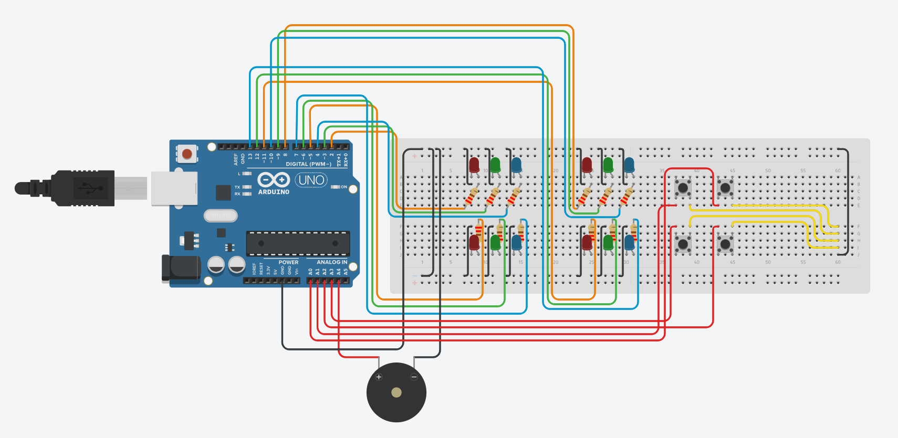

# ColorWizard

ColorWizard is an interactive memory game, with a colorful twist, built using Arduino (Elegoo). The objective of the game is to remember and replicate sequences of colors displayed by LEDs.

## Demo

Watch the demo video of ColorWizard on YouTube:

[](https://www.youtube.com/watch?v=EEwhJd93c-o)

## Features
- Four positions with three color options (Red, Green, Blue).
- Increasing difficulty levels.
- Real-time feedback using LEDs and a buzzer.

## Components
- 1 Arduino Uno (Elegoo MEGA Controller Board)
- 4 Red LEDs
- 4 Green LEDs
- 4 Blue LEDs
- 4 Push buttons
- 1 Buzzer
- 12 Resistors (220Ω for LEDs)
- Breadboard and jumper wires

## Circuit Diagram


You can also refer to the [Schematic View](docs/schematic_view.pdf). It provides clarity, aids in problem-solving, and ensures that your circuit is assembled correctly and safely.

## Setup Guide
Refer to the [setup guide](docs/setup_guide.md) for detailed instructions on wiring and assembling the components.

## Installation
1. Download or clone this repository.
    ```bash
    git clone https://github.com/BestPlayerMMIII/ColorWizard.git
    ```
2. Open `ColorWizard.ino` in the Arduino IDE.
3. Upload the code to your Arduino Uno.

## Gameplay
1. After powering up, the game starts at level 1.
2. Watch the sequence of colors displayed by the LEDs.
3. Replicate the sequence by pressing the corresponding buttons:
   - Short press (less than 0.75 seconds): Red
   - Medium press (0.75 to 1.5 seconds): Green
   - Long press (more than 1.5 seconds): Blue
4. The game adds a new color to the sequence with each level.
5. If you replicate the sequence correctly, you advance to the next level. If not, the game ends.

## Example Sequence
An example of the sequence generated by the game can be found in [example_sequence.txt](examples/example_sequence.txt).

## Contribution
Feel free to open issues or submit pull requests for improvements and bug fixes.

## License
This project is licensed under the MIT License - see the [LICENSE](LICENSE.txt) file for details.
