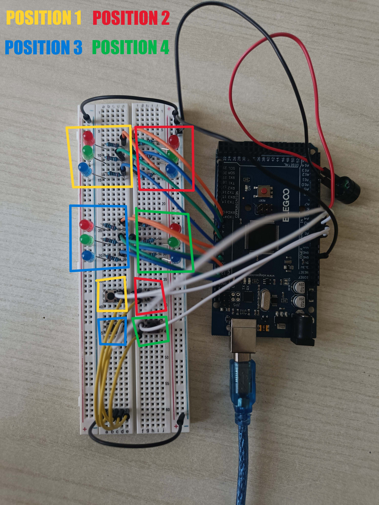

# ColorWizard Setup Guide

This guide will help you assemble the ColorWizard project, including wiring the components and uploading the code to your Arduino.

## Components Needed

- 1 Arduino Uno (or Elegoo MEGA Controller Board)
- 4 Red LEDs
- 4 Green LEDs
- 4 Blue LEDs
- 4 Push buttons
- 1 Buzzer
- 12 Resistors (220Ω each) for LEDs
- Breadboard
- Jumper wires

## Circuit Diagram

Below is a wiring diagram to help you assemble the components. Refer to it throughout the setup process.


The following is the convention used for numbering positions. Refer to it throughout the setup process.



## Wiring the Components

### 1. LEDs

#### Positions
- **Position 1:** Red LED on pin 5, Green LED on pin 6, Blue LED on pin 7
- **Position 2:** Red LED on pin 2, Green LED on pin 3, Blue LED on pin 4
- **Position 3:** Red LED on pin 11, Green LED on pin 12, Blue LED on pin 13
- **Position 4:** Red LED on pin 8, Green LED on pin 9, Blue LED on pin 10

#### Steps
1. Place the LEDs on the breadboard.
2. Connect the anode (long leg) of each LED to a 220Ω resistor, and each resistor to a separate pin on Arduino as listed above.
3. Connect the cathode (short leg) to GND.

### 2. Push Buttons

#### Positions
- **Position 1:** Button on pin A3
- **Position 2:** Button on pin A1
- **Position 3:** Button on pin A2
- **Position 4:** Button on pin A0

#### Steps
1. Place the push buttons on the breadboard.
2. Connect one leg of each button to a separate analog pin on Arduino as listed above.
3. Connect the other leg of each button directly to GND.

### 3. Buzzer

1. Connect the positive leg of the buzzer to pin A4 on Arduino.
2. Connect the negative leg of the buzzer to GND.

## Uploading the Code

1. Download or clone the repository:
    ```bash
    git clone https://github.com/BestPlayerMMIII/ColorWizard.git
    ```
2. Open `src/ColorWizard/ColorWizard.ino` in the Arduino IDE.
3. Connect your Arduino Uno (or Elegoo MEGA Controller Board) to your computer using a USB cable.
4. Select the correct board and port in the Arduino IDE:
    - **Board:** Arduino Uno (or Arduino Mega / Mega 2560)
    - **Port:** Select the port your Arduino is connected to
5. Click the "Upload" button in the Arduino IDE to upload the code to your Arduino.

## Testing the Setup

1. Once the code is uploaded, the game should start automatically.
2. The LEDs will light up in a sequence. Try to replicate the sequence using the push buttons.
3. Short press (less than 0.75 seconds) for Red, medium press (0.75 to 1.5 seconds) for Green, and long press (more than 1.5 seconds) for Blue.

## Troubleshooting

- **LEDs not lighting up:** Check the connections and ensure the LEDs are connected in the correct orientation.
- **Buttons not responding:** Verify the wiring of the buttons and make sure they are properly connected to GND and the Arduino pins.
- **Buzzer not making sound:** Ensure the buzzer is connected to the correct pin and that the code is uploaded correctly.

If you encounter any issues, refer to the wiring diagram and double-check your connections. 

## Conclusion

You have successfully set up the ColorWizard project! Enjoy playing the game and challenge your friends to beat your high score.
